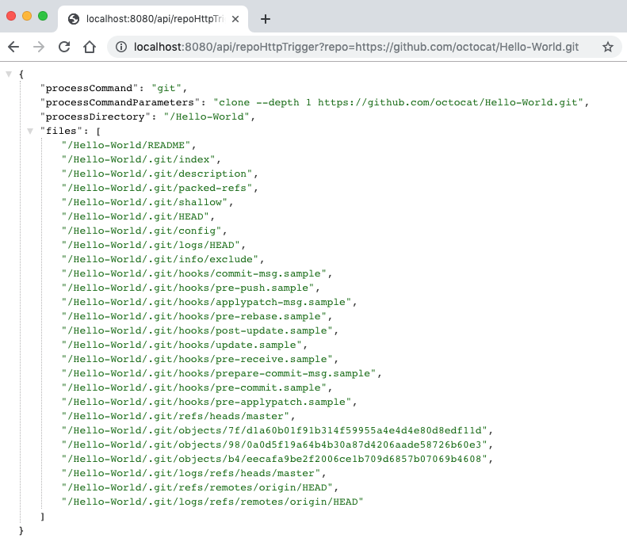

# GitCloneFunction

An Azure Function code sample that demonstrates executing system processes like `git clone` in a serverless Docker container using .NET Standard. The code uses an HttpTrigger and a querystring parameter to get a repo URL, clone locally and return the results.

## Example:

Calling `http://localhost:7071/api/repoHttpTrigger?repo=https://github.com/octocat/Hello-World.git`

Would return the following:



**repo={url.git}**: A valid git repo URL, including `.git` extension. For example: `https://github.com/octocat/Hello-World.git`

### Run From Visual Studio Code

From Visual Studio Code, install the Azure Functions extension and click F5.

### From Azure Functions command line

```
func start --build
```

### From Docker

#### Step 1: Build the Docker Image

From the `GitCloneFunction` directory, run `docker build`

```
docker build -t gitclonefunction .
```

#### Step 2: Run the Docker Container

Below we run the container in interactive mode with tty using `-it`, but you can run detached instead by running with `-d`

```
docker run -p 8080:80 -it gitclonefunction
```

#### Step 3: Open a browser to preview

Make sure you use port 8080 or whatever port was specified in the `-p` parameter: `http://localhost:8080/api/repoHttpTrigger?repo=https://github.com/octocat/Hello-World.git`
